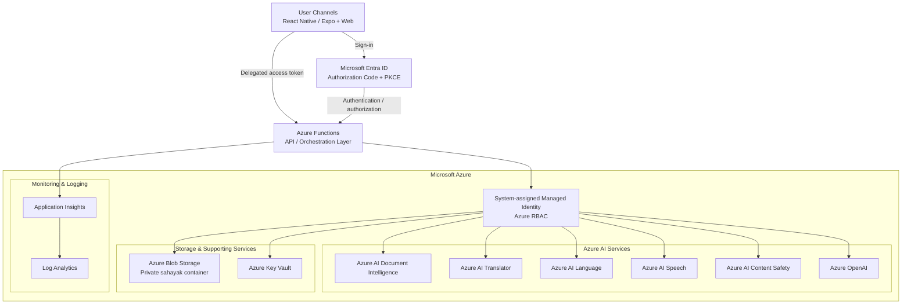

# Sahayak

### AI-powered, multilingual access to government schemes and documents

Sahayak is an end-to-end accessibility solution that helps users discover relevant government-scheme information, understand documents, translate extracted content, interact through voice, and prepare reviewed form answers using text, speech, or supporting evidence.

The solution is built around a React Native / Expo client, an Azure Functions API and orchestration layer, Microsoft Entra ID authentication, managed identity with Azure RBAC, and Azure AI services for document understanding, translation, language analysis, speech, content safety, and AI-assisted responses. Documents and generated content are stored in a private Azure Blob Storage container, with Application Insights and Log Analytics available for operational visibility.

## Table of contents

- [High-level architecture](#1-high-level-architecture)
- [Authentication, identity, and access](#2-authentication-identity-and-access)
- [Project layout](#3-project-layout)
- [Run locally without Azure](#4-run-locally-without-azure)
- [Azure deployment prerequisites](#5-prerequisites-for-azure-deployment)
- [Create the Entra app registrations](#6-create-the-two-entra-app-registrations)
- [Provision Azure resources](#7-configure-and-provision-azure-resources)
- [Build and deploy the API](#8-build-and-deploy-the-api-code)
- [Backend configuration](#9-backend-settings-exact-names-and-where-to-find-values)
- [Connect the React Native / web app](#10-connect-the-react-native--web-app)
- [Validate deployment](#11-confirm-deployment-behavior)
- [Troubleshooting](#12-troubleshooting)
- [Boundaries and data handling](#13-boundaries-and-data-handling)
- [Official references](#14-official-sdk-and-service-references)


## 1. High-level architecture

Sahayak follows a layered Azure architecture in which the client communicates with a protected API, while the API orchestrates Azure AI and storage services using managed identity and Azure RBAC.




### Architecture components

| Layer | Components | Responsibility | Status in this repository |
| --- | --- | --- | --- |
| User channels | React Native / Expo, Web | User interaction, sign-in, scheme/document workflows, multilingual UI | **Implemented** |
| API / orchestration | Azure Functions | Request validation, authentication, orchestration, response formatting, error handling | **Implemented** |
| Identity | Microsoft Entra ID | User authentication and delegated API access using authorization code + PKCE | **Implemented** |
| Service identity | System-assigned managed identity + Azure RBAC | Secure API access to Azure AI, Blob Storage, and Key Vault | **Implemented** |
| Document AI | Azure AI Document Intelligence | OCR, document extraction, tables, key/value pairs | **Implemented** |
| Translation | Azure AI Translator | Translation of extracted document text and user content | **Implemented** |
| Language | Azure AI Language | Language detection and text analysis | **Implemented** |
| Speech | Azure AI Speech | Speech-to-text and text-to-speech | **Implemented** |
| Safety | Azure AI Content Safety | Harmful-content detection | **Implemented** |
| Generative AI | Azure OpenAI | AI-assisted conversations, explanations, summaries and Q&A | **Implemented** |
| Document storage | Azure Blob Storage | Private storage for uploaded documents and generated content | **Implemented** |
| Secrets | Azure Key Vault | Provisioned security boundary for secrets and future integrations | **Provisioned; not directly called by current app** |
| Observability | Application Insights, Log Analytics | Logs, traces, metrics and centralized diagnostics | **Provisioned** |

### Architecture boundaries

The architecture diagram may show additional enterprise integrations or perimeter controls such as WhatsApp/Twilio, DigiLocker, Azure WAF, DDoS Protection, Private Endpoints, Network Security Groups, Microsoft Defender for Cloud, or a dedicated Computer Vision service. These are **architectural extension points, not claims about the current codebase**. The current implementation does not implement WhatsApp/Twilio, DigiLocker, government submission, WAF, DDoS protection, NSGs, Defender integration, private endpoints, or a separate Computer Vision service. Document OCR and extraction are handled through Azure AI Document Intelligence.

This distinction keeps the README aligned with the intended enterprise architecture while accurately describing what can be provisioned and exercised from this repository today.

## 2. Authentication, identity, and access

**You do not need to paste Azure AI service API keys into this application.** The implemented Azure path uses `DefaultAzureCredential` and the Function App's system-assigned managed identity. The Bicep template disables API-key authentication on its Azure AI resources.

There are two separate authentication paths:

| Connection | Authentication |
| --- | --- |
| React Native / web app to Sahayak API | User signs in through Microsoft Entra, using authorization code + PKCE. The app sends a delegated access token. |
| Sahayak API to Azure AI and document storage | Function App managed identity with resource-scoped Azure RBAC roles. Local development can use `az login` with equivalent roles. |

| Service | What you configure instead of a key | Function identity permission |
| --- | --- | --- |
| Document Intelligence | Resource custom-domain endpoint | Cognitive Services User |
| Translator | Resource custom-domain endpoint, not the global Translator URL | Cognitive Services User |
| Azure Language | Resource custom-domain endpoint | Cognitive Services User |
| Azure Speech | Custom-domain endpoint, region, and full Azure resource ID | Cognitive Services User |
| Azure Content Safety | Resource custom-domain endpoint | Cognitive Services User |
| Azure OpenAI | Resource endpoint and **model deployment name** | Cognitive Services OpenAI User |
| Blob Storage for documents | Blob service URL and private `sahayak` container | Storage Blob Data Contributor, scoped to the container |
| Key Vault | No application setting needed in the current implementation | Key Vault Secrets User; provisioned for future connectors, not currently called by the app |

**Server-only exceptions:** The template sets `AzureWebJobsStorage` to a storage-account-key connection string for the Functions host, and sets `APPLICATIONINSIGHTS_CONNECTION_STRING` for telemetry. These are configured automatically by Bicep. The host-storage connection is not the authentication method used for document access. Never copy either setting into the mobile app or a public repository.

**No mobile client secret is required.** Tenant IDs, client IDs, endpoints, scope names, and Speech resource IDs are identifiers, not secret keys. Access tokens, storage keys, connection strings, and client secrets must not be committed or shared.

Adding variables such as `AZURE_OPENAI_API_KEY` or `AZURE_SPEECH_KEY` will **not** enable key authentication: this code does not read them. Do not collect or distribute service keys for this application. A Function key also does not replace the required user access token.

## 3. Project layout

```text
sahayak-hackathon\
  apps\mobile\              Expo React Native client, also runnable on web
  apps\api\                 Azure Functions and local Node API
  packages\shared\          Shared types and request schemas
  infra\main.bicep          Azure resources, managed identity, settings, RBAC
  infra\main.bicepparam     Deployment parameters to edit
  infra\package-api.ps1     Builds the Functions deployment ZIP
  scripts\package-source.ps1
  samples\                 Fictional forms and evidence
  START_HERE.txt            Short demo walkthrough
  SETUP.txt                 Extended operational notes
```

### Technology stack

- **Client:** React Native + Expo, with web support
- **API:** Node.js + Azure Functions
- **Identity:** Microsoft Entra ID, authorization code + PKCE
- **API-to-resource security:** System-assigned managed identity + Azure RBAC
- **Document AI:** Azure AI Document Intelligence
- **Language services:** Azure AI Translator and Azure AI Language
- **Voice:** Azure AI Speech
- **Safety:** Azure AI Content Safety
- **Generative AI:** Azure OpenAI
- **Storage:** Azure Blob Storage with a private `sahayak` container
- **Secrets:** Azure Key Vault (provisioned for future integrations)
- **Observability:** Azure Application Insights + Azure Log Analytics
- **Infrastructure as code:** Azure Bicep

## 4. Run locally without Azure

Install Node.js **22.9 or newer** and npm. Run the following in PowerShell from the extracted project root.

Terminal 1:

```powershell
npm ci
npm run api
```

Terminal 2, also from the project root:

```powershell
npm run web
```

Open `http://localhost:8081`. The API listens on `http://localhost:7071/api`.

Confirm fictional-data use, open the sample form, and try explanation, `Label: value` filling, individual answer confirmation, and export. The `Schemes` tab uses an illustrative catalog with official links.

**Local demo limits:** English, deterministic text handling, plain-text uploads, and device read-aloud only. PDF/image OCR, AI conversation, translation, automatic language detection, and speech recognition require Azure mode. These operations are not simulated as live Azure results.

For a phone/emulator, run `npm run mobile`. A physical phone's `localhost` is not your computer. On a trusted private development network, configure the API process with `$env:API_HOST='0.0.0.0'` and point `EXPO_PUBLIC_API_URL` at your computer's LAN address. Android emulators typically use `http://10.0.2.2:7071/api`. Do not expose unauthenticated demo mode publicly; use HTTPS for deployed environments.

## 5. Prerequisites for Azure deployment

- An Azure subscription with permission to create resources **and assign roles**, such as Contributor plus Role Based Access Control Administrator at the appropriate scope.
- Azure CLI with Bicep, and permission to register the required resource providers: Microsoft.Web, Microsoft.Storage, Microsoft.CognitiveServices, Microsoft.OperationalInsights, Microsoft.Insights, and Microsoft.KeyVault.
- An Entra tenant where you can create the two app registrations below or obtain them from an administrator.
- Azure AI availability in your selected regions, plus quota for a compatible Azure OpenAI chat model.
- A supported model deployment for the code's chat-completions API, JSON mode, `temperature`, and `max_tokens` parameters. Not every reasoning model is interchangeable.

> **Costs:** The template uses a dedicated Linux **B1 App Service plan**, which is billed continuously, not a free scale-to-zero Functions plan. AI services and telemetry can incur additional charges. Set budgets and review regional availability before deploying.

## 6. Create the two Entra app registrations

In Azure Portal, open **Microsoft Entra ID > App registrations**. This starter uses a single workforce tenant; it does not implement general citizen onboarding with Entra External ID.

### API registration

1. Create an app registration for the Sahayak API in your tenant.
2. Record its **Directory (tenant) ID** and **Application (client) ID**.
3. Under **Expose an API**, use `api://<API-CLIENT-ID>` as the Application ID URI and add delegated scope `access_as_user`.
4. In the registration manifest, set `api.requestedAccessTokenVersion` to `2`.

The API registration's client ID is the backend's `ENTRA_API_AUDIENCE`. Use the GUID, **not** the `api://` URI.

### Mobile / web registration

1. Create a separate client app registration in the same tenant.
2. Under **API permissions**, add the API registration's delegated `access_as_user` permission. Obtain administrator consent if tenant policy requires it.
3. Under **Authentication**, register `http://localhost:8081` as a **Single-page application** redirect URI for local web use.
4. Register the actual hosted web origin as another SPA redirect when hosting the frontend.
5. For native builds, add `sahayak://auth` under **Mobile and desktop applications**.
6. Record this registration's Application (client) ID. **Do not create or embed a client secret.**

The app's Settings screen displays the exact redirect URI. Scheme, hostname, port, and path must match registration. The app uses authorization code + PKCE, not implicit authentication. Native OAuth requires an installed native build; Expo Go is not a substitute for configuring the custom redirect.

## 7. Configure and provision Azure resources

Edit `infra\main.bicepparam` before deployment:

| Parameter | Set it to |
| --- | --- |
| `entraTenantId` | Your Entra Directory (tenant) ID |
| `entraApiAudience` | The **API registration's** Application (client) ID |
| `apiCorsOrigin` | Exact frontend origin, initially `http://localhost:8081`; no trailing slash |
| `namePrefix` | Short lowercase letters/digits identifying this deployment |
| `location` and individual service location parameters | Regions supporting the selected services, Speech features, and model |
| `openAiDeploymentName` | A deployment name you choose, for example `sahayak-chat` |
| `deployOpenAiModel` | `true` to deploy a model with the template, or `false` to deploy a compatible model manually afterward |
| `openAiModelName`, `openAiModelVersion`, `openAiDeploymentSku`, `openAiCapacity` | Currently available, quota-supported model settings |

The checked-in model/version and regions are **examples**, not an availability guarantee. `deployOpenAiModel` defaults to `false`: creating an OpenAI account alone does not make AI features work. If deploying the model manually, use the configured deployment name or update `AZURE_OPENAI_DEPLOYMENT` accordingly.

From the project root, run each command separately and stop if it fails:

```powershell
az login
az account set --subscription '<YOUR-SUBSCRIPTION-ID>'
az bicep install
az bicep build --file .\infra\main.bicep
az bicep build-params --file .\infra\main.bicepparam

az group create --name rg-sahayak-demo --location eastus2
az deployment group what-if --resource-group rg-sahayak-demo --parameters .\infra\main.bicepparam
```

Review the proposed resources and costs. When ready to provision:

```powershell
az deployment group create --name sahayak --resource-group rg-sahayak-demo --parameters .\infra\main.bicepparam

$functionName = az deployment group show --resource-group rg-sahayak-demo --name sahayak --query properties.outputs.functionAppName.value --output tsv
$apiUrl = az deployment group show --resource-group rg-sahayak-demo --name sahayak --query properties.outputs.apiBaseUrl.value --output tsv
```

Bicep provisions the Function App, B1 plan, AI accounts, private-access Blob container, retention policy, Key Vault, Application Insights, Log Analytics, identity, role assignments, and backend settings. App registrations and frontend hosting are separate.

Allow time for RBAC assignments to propagate. Partial deployment failures can still leave billable resources.

## 8. Build and deploy the API code

From the project root:

```powershell
npm ci
npm run build:api
.\infra\package-api.ps1
```

The packaging script installs production dependencies in temporary staging and creates:

```text
infra\artifacts\sahayak-api.zip
```

It includes compiled API code, `host.json`, and runtime dependencies, including the compiled shared package. It excludes `.env` and `local.settings.json`. The dependency-install step needs registry access and may take several minutes; do not proceed unless packaging succeeds.

Deploy that **API ZIP**, not the source-code submission ZIP:

```powershell
az functionapp deployment source config-zip --resource-group rg-sahayak-demo --name $functionName --src .\infra\artifacts\sahayak-api.zip
Invoke-RestMethod "$apiUrl/health"
```

The health response should report `mode: azure`. Health alone does not prove AI services are working. Protected endpoints require a signed-in user's delegated access token.

The template disables basic publishing authentication and remote builds. Use a current Azure CLI supporting Entra-authenticated ZIP deployment. Do not enable password publishing or remove API authentication to work around a deployment failure.

## 9. Backend settings: exact names and where to find values

For a template deployment, these are populated automatically under **Function App > Settings > Environment variables**. For existing resources or local Azure-mode testing, supply the corresponding values yourself.

All endpoint variables below must be HTTPS **origins**, with no API path, query, or credentials. The server appends the correct service paths.

| Environment variable | Value / where to find it |
| --- | --- |
| `SAHAYAK_MODE` | `azure` for real services; hosted demo mode is rejected |
| `AZURE_DOCUMENT_INTELLIGENCE_ENDPOINT` | Document Intelligence resource's custom endpoint, e.g. `https://<name>.cognitiveservices.azure.com` |
| `AZURE_TRANSLATOR_ENDPOINT` | Translator resource's custom endpoint on `cognitiveservices.azure.com`; do not use the global API endpoint |
| `AZURE_LANGUAGE_ENDPOINT` | Language resource's custom endpoint on `cognitiveservices.azure.com` |
| `AZURE_SPEECH_ENDPOINT` | Speech resource's custom endpoint on `cognitiveservices.azure.com`; not the regional STT/TTS URL |
| `AZURE_SPEECH_REGION` | Speech resource's Azure region code, e.g. `eastus`, if supported |
| `AZURE_SPEECH_RESOURCE_ID` | Speech resource > Properties > Resource ID; full `/subscriptions/.../resourceGroups/.../providers/Microsoft.CognitiveServices/accounts/...` value |
| `AZURE_CONTENT_SAFETY_ENDPOINT` | Content Safety resource's custom endpoint on `cognitiveservices.azure.com` |
| `AZURE_OPENAI_ENDPOINT` | Azure OpenAI resource endpoint, normally `https://<name>.openai.azure.com` |
| `AZURE_OPENAI_DEPLOYMENT` | Actual model **deployment name**, e.g. `sahayak-chat`; not automatically the base model name |
| `AZURE_STORAGE_ACCOUNT_URL` | Storage account > Endpoints > Blob service, e.g. `https://<account>.blob.core.windows.net` |
| `AZURE_STORAGE_CONTAINER` | `sahayak`; must already exist and not permit anonymous access |
| `ENTRA_TENANT_ID` | Directory (tenant) ID |
| `ENTRA_API_AUDIENCE` | API registration client ID GUID |
| `ENTRA_REQUIRED_SCOPE` | `access_as_user` |
| `API_CORS_ORIGIN` | One exact browser frontend origin, e.g. `https://<your-web-host>` |

AI resource endpoints can be found in their **Keys and Endpoint** or **Resource Management** pages, but copy the endpoint, **not the key**. If reusing a resource without a custom subdomain, configure the supported custom endpoint first. Do not substitute a project-level Foundry URL for an Azure OpenAI resource endpoint.

Keep backend identifiers separate from mobile identifiers: `ENTRA_API_AUDIENCE` uses the API registration; `EXPO_PUBLIC_ENTRA_CLIENT_ID` uses the client registration.

### Local API calling real Azure

Copy `apps\api\.env.example` to `apps\api\.env`, replace every placeholder, and change the existing `SAHAYAK_MODE=demo` line to `SAHAYAK_MODE=azure`.

```powershell
Copy-Item .\apps\api\.env.example .\apps\api\.env
# Edit apps\api\.env before continuing; do not overwrite a file already configured.
az login --tenant '<YOUR-TENANT-ID>'
npm run api
```

The local Node server loads that `.env`. Your logged-in identity needs the same relevant **data-plane** roles listed in section 1; being a resource Contributor is not enough. Bicep grants roles to the Function identity, not automatically to your development account.

When using Functions Core Tools instead of the local Node server, use `apps\api\local.settings.example.json` as a starting point for ignored `local.settings.json`, add the Azure values, and configure host storage. Core Tools needs a build first; `UseDevelopmentStorage=true` additionally requires Azurite. See `apps\api\OPERATIONS.txt`.

## 10. Connect the React Native / web app

In a new PowerShell terminal at the project root:

```powershell
$env:EXPO_PUBLIC_API_URL = 'https://<FUNCTION-APP>.azurewebsites.net/api'
$env:EXPO_PUBLIC_ENTRA_TENANT_ID = '<YOUR-TENANT-ID>'
$env:EXPO_PUBLIC_ENTRA_CLIENT_ID = '<MOBILE-WEB-REGISTRATION-CLIENT-ID>'
$env:EXPO_PUBLIC_ENTRA_API_SCOPE = 'api://<API-REGISTRATION-CLIENT-ID>/access_as_user'

npm run build:shared
npm run web
```

Alternatively, copy `apps\mobile\.env.example` to `apps\mobile\.env` and fill these values there. Do not overwrite an existing configured file. Restart Expo after changing environment variables.

`EXPO_PUBLIC_ENTRA_REDIRECT_URI` is optional. Leave it unset to use the current web origin or native `sahayak://auth`; otherwise it must exactly match a registered redirect.

**All `EXPO_PUBLIC_*` values are embedded in the app. Never put service keys, access tokens, connection strings, or a client secret in them.**

Sign in and approve the app's processing consent before sending fictional data to Azure.

### Native Android / iOS

Use `npm run mobile` for the Expo development server. To install a native Android build with the custom OAuth scheme, configure Android Studio/SDK tooling, then run:

```powershell
Set-Location .\apps\mobile
npx expo run:android
```

An iOS native build requires macOS and Xcode. Use your organization's owned package/bundle identifiers before distribution. The included `eas.json` provides build profiles, but Expo account/project setup, signing, and app-store publishing are not provisioned by this repository.

### Host the web frontend

With the correct public environment values set, export from the project root:

```powershell
npm run build:shared
npm run export:web --workspace @sahayak/mobile
```

Publish the contents of `apps\mobile\dist` to an HTTPS static web host, such as a separately configured Azure Static Web Apps site. The Bicep template does **not** create or publish that frontend.

Add its exact origin as a SPA redirect in the client registration. Set `apiCorsOrigin` to that origin in `infra\main.bicepparam` and reapply the deployment so both platform CORS and `API_CORS_ORIGIN` stay aligned. Rebuild/redeploy the frontend when public environment values change. Changing a server setting does not alter an already-built client.

## 11. Confirm deployment behavior

Run source checks from the project root:

```powershell
npm run typecheck
npm test
```

Then exercise the actual Azure environment with fictional data:

1. Confirm health says `azure`, and protected endpoints reject requests without a valid user token.
2. Sign in, approve processing consent, and send a question.
3. Upload a small fictional PDF/image and compare extracted text against its source.
4. Explain the document, translate its extracted text, and replay a response.
5. Configure the voice panel's candidate locale codes, record speech, and review the transcript. Verify language switching for supported languages.
6. Fill a draft from text or evidence, review every nonempty value, confirm it, and export.
7. Delete the document and confirm it can no longer be retrieved.

Translator, OCR, Speech recognition, and voice synthesis have **different** language and region coverage. The voice panel accepts up to four candidate Speech locales, initially `en-IN, hi-IN, te-IN, ta-IN`. Replace these for other supported speech languages.

## 12. Troubleshooting

| Symptom | What to check |
| --- | --- |
| Startup reports missing configuration | Fill every required backend variable, including `AZURE_SPEECH_RESOURCE_ID`. There is no silent Azure-to-demo fallback. |
| API returns 401 | Sign in again; check tenant, token expiry, and API audience. Use an access token, not an ID token or Function key. |
| API returns 403 | Check delegated `access_as_user`, tenant, consent, and browser origin. |
| Entra redirect mismatch | Register the exact URI shown in app Settings under the correct SPA/native platform. |
| Azure operation returns 502/503 | Check managed-identity role scope/propagation, resource endpoint, supported region/API/model, and throttling. Inspect safe server diagnostics; never log document bodies or tokens. |
| OpenAI deployment not found | Deploy the model and match its deployment name to `AZURE_OPENAI_DEPLOYMENT`. The template defaults to account-only provisioning. |
| Health works but browser actions fail | Align platform CORS, `API_CORS_ORIGIN`, actual browser origin, and client API URL ending in `/api`. |
| Phone cannot reach localhost | Use a reachable LAN address for local development or the deployed HTTPS API URL. |
| Voice does not play | Try Replay after a user gesture, check installed device voices, and inspect the explicit Azure-to-device fallback notice. Long responses use device read-aloud. |
| A write times out | Reload the saved document before retrying; the write may have completed. |
| Packaging/install fails | Check Node version and registry/network access. If the lockfile references your organization's package mirror, ensure it is reachable or regenerate an approved lockfile for the target environment. Do not publish registry credentials. |

## 13. Boundaries and data handling

- The scheme catalog is illustrative and needs ongoing maintenance; matches are not eligibility decisions.
- Export creates a reviewed UTF-8 answer sheet, **not** a filled, signed, or submitted original PDF. Translation does not preserve the source document layout.
- WhatsApp/Twilio, DigiLocker, government submission, private endpoints, WAF, DDoS plans, NSGs, and Defender integration are not implemented.
- A private Blob container means no anonymous data access; this template still uses public network endpoints.
- Derived documents have a 24-hour application access window. Storage lifecycle deletion is asynchronous and based on last modification; it is not guaranteed physical erasure at exactly 24 hours. Upstream service retention is separate.
- Key Vault is provisioned for future use. Do not invent Twilio/DigiLocker credentials for nonexistent connectors.
- This implementation still needs additional production hardening, including abuse/cost controls, malware scanning, privacy review, consumer identity, operational monitoring, and deployment-specific validation.
- Remove unused demo resources after review. A stopped app does not necessarily stop its dedicated plan's charges; Key Vault purge protection also affects deletion/reuse.

## 14. Official SDK and service references

- [Azure Functions Node.js developer guide](https://learn.microsoft.com/azure/azure-functions/functions-reference-node)
- [Azure Identity for JavaScript](https://learn.microsoft.com/javascript/api/overview/azure/identity-readme)
- [Document Intelligence JavaScript SDK](https://learn.microsoft.com/javascript/api/overview/azure/ai-document-intelligence-rest-readme)
- [Translator authentication](https://learn.microsoft.com/azure/ai-services/translator/text-translation/reference/authentication)
- [Language detection](https://learn.microsoft.com/azure/ai-services/language-service/language-detection/quickstart)
- [Speech fast transcription](https://learn.microsoft.com/azure/ai-services/speech-service/fast-transcription-create)
- [Speech text-to-speech REST API](https://learn.microsoft.com/azure/ai-services/speech-service/rest-text-to-speech)
- [Azure OpenAI quickstart](https://learn.microsoft.com/azure/ai-foundry/openai/quickstart)
- [Content Safety](https://learn.microsoft.com/azure/ai-services/content-safety/overview)
- [Blob Storage JavaScript SDK](https://learn.microsoft.com/javascript/api/overview/azure/storage-blob-readme)

For additional operational details, read `SETUP.txt`, `apps\api\OPERATIONS.txt`, and `apps\mobile\SETUP.txt`. Follow your hackathon's rules for disclosing AI-assisted code.
